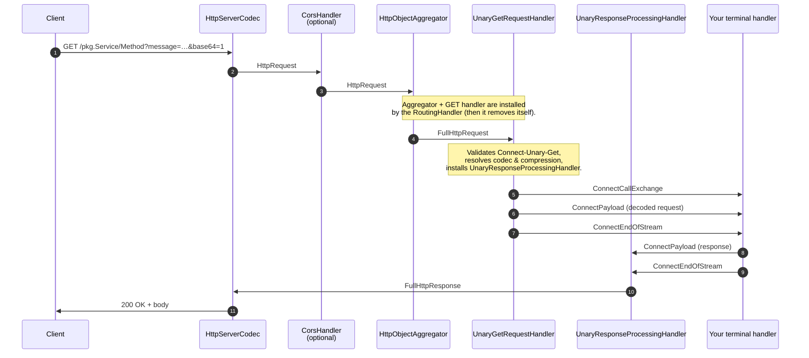
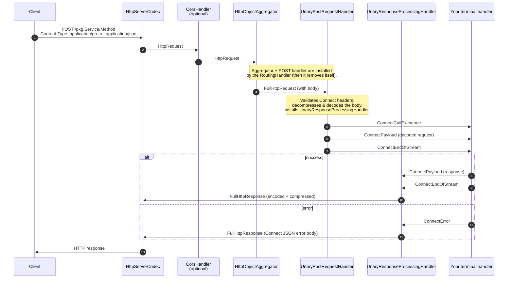
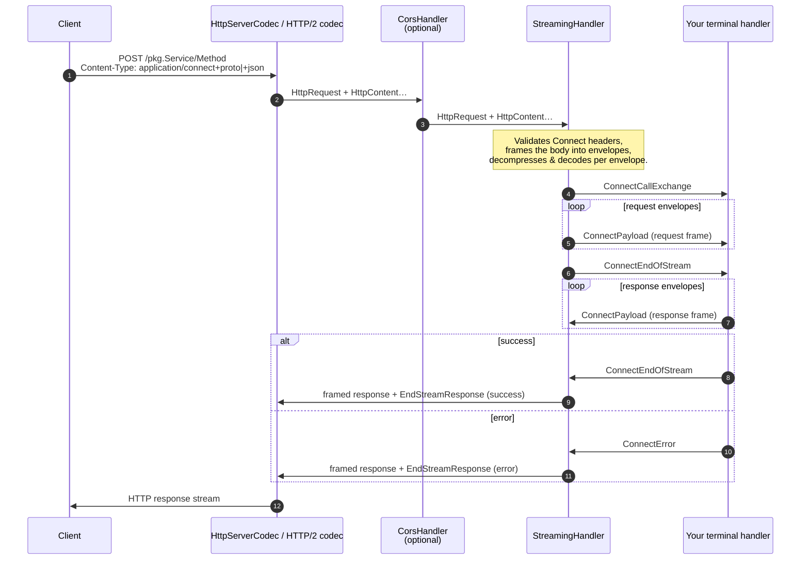

# connect-java

[](https://www.apache.org/licenses/LICENSE-2.0)

A standalone implementation of the [Connect RPC](https://connectrpc.com/docs/protocol) protocol
for **vanilla Netty 4.2.x**.

`connect-java` is shaped as a chain of Netty channel handlers that you wire into
your own pipeline and that delegate every routed RPC to a handler **you** control.
It does not own the server, the transport, the service descriptor format, or the
threading model. Bring your own Netty server, your own service abstraction
(plain proto, gRPC-style stubs, Reactor, virtual threads, whatever you like),
and let this library cover the Connect protocol layer between the HTTP codec and
your service code.

> ### About the project
>
> `connect-java` is a hobby project written in spare time, with heavy use of AI
> coding assistants ([Claude Code](https://claude.com/product/claude-code) and
> [ChatGPT Codex](https://openai.com/codex/)). The protocol surface is
> conformance-verified, but the project is pre-1.0 — APIs may evolve.

## Requirements

- **Java 21** or newer. The library uses sealed interfaces and pattern matching
  in switch expressions; downgrading is not on the roadmap.
- **Netty 4.2.x.** 4.2 is intentional: it is the first Netty line that lines up
  with the incubator HTTP/3 codec, which is where transport work in this
  library is heading. Older Netty 4.1 deployments are not supported.
- **Protobuf 4.29+** *(optional)* — only required if you use the bundled
  `ConnectProtobufCodec` / `ConnectProtobufJsonCodec`. Both are declared
  `optional` in the POM; if you ship your own codecs you can exclude the
  protobuf dependency entirely.

## Table of contents

- [Why another Connect implementation](#why-another-connect-implementation)
- [Protocol coverage](#protocol-coverage)
- [Quickstart: plain HTTP/1.1 Netty server](#quickstart-plain-http11-netty-server)
- [Pipeline shape](#pipeline-shape)
- [Domain model](#domain-model)
- [Handler API](#handler-api)
- [Extension points](#extension-points)
- [Multi-protocol server example](#multi-protocol-server-example)
- [Recommended companions](#recommended-companions)
- [License](#license)

## Why another Connect implementation

The intended differentiator is **integration flexibility**:

- **Pipeline-native.** The protocol is implemented as Netty `ChannelHandler`s. No
  hidden server, no embedded Jetty, no Servlet container — the handlers slot into
  any pipeline that already carries `HttpServerCodec` (HTTP/1.1) or an HTTP/2
  stream channel.
- **No opinion on the service abstraction.** The "terminal" handler at the end of
  the chain is one you supply via a `ConnectCallHandlerFactory`. Wire it to
  generated proto stubs, hand-rolled handlers, a Reactor pipeline, or anything
  else that consumes `ConnectCallExchange` + `ConnectPayload` and writes
  `ConnectPayload`/`ConnectError`/`ConnectEndOfStream` back.
- **Vanilla Netty.** Works with `ServerBootstrap`, with Reactor Netty, and with
  any framework that exposes the underlying Netty pipeline.

## Protocol coverage

- All four Connect method kinds: **unary** (POST and GET-idempotent), **client
  streaming**, **server streaming**, **bidirectional streaming**.
- Conformance-verified against the official
  [connectrpc/conformance](https://github.com/connectrpc/conformance) suite —
  **1438/1438 tests passing**. A ready-to-run Docker image for reproducing
  conformance locally is on the near-term roadmap.
- Transports:
  - **HTTP/1.1** — unary, client streaming, server streaming.
  - **HTTP/2** — all four method kinds (bidi requires HTTP/2 by spec).
  - **HTTP/3** — planned; the 4.2 Netty baseline is chosen specifically so the
    incubator HTTP/3 codec can be added without a major version bump.
- HTTP/1.1 **keep-alive** support — the cornerstone of low-latency unary RPC
  over a connection pool. Routed handlers are per-request; persistent handlers
  installed upstream survive across requests.
- Full **header and trailer passthrough**, including binary `-bin` metadata
  encoded per the Connect/gRPC convention.
- Optional **CORS** with Connect-aware defaults (allowed methods, headers, and
  preflight max-age) and exact-origin or wildcard policies.
- Message **compression** with a pluggable registry; identity and gzip
  out of the box.
- Per-method **timeout** enforcement (`Connect-Timeout-Ms`) and Connect-native
  error responses with full error-code coverage.

## Quickstart: plain HTTP/1.1 Netty server

The snippet below shows the smallest interesting wiring: a single proto service
served over plain HTTP/1.1.

```java
import io.netty.bootstrap.ServerBootstrap;
import io.netty.channel.*;
import io.netty.channel.nio.NioEventLoopGroup;
import io.netty.channel.socket.nio.NioServerSocketChannel;
import io.netty.handler.codec.http.HttpServerCodec;

import io.suboptimal.connectjava.codec.protobuf.ConnectProtobufCodecs;
import io.suboptimal.connectjava.model.*;
import io.suboptimal.connectjava.protocol.*;

import java.util.Map;

ConnectServiceDefinition greeter = new ConnectServiceDefinition(
    "greet.v1.GreetService",
    Map.of(
        "Greet", new ConnectMethodDefinition(
            "Greet",
            ConnectMethodType.UNARY,
            GreetRequest.class,   // generated proto class
            GreetResponse.class,
            /* idempotent — also reachable via Unary-GET */ true)),
    /* optional descriptor for introspection */ null);

ConnectProtocolConfig config = ConnectProtocolConfig
    .builder(
        Map.of(greeter.serviceName(), greeter),
        GreeterCallHandler::new,                       // ConnectCallHandlerFactory
        new ConnectProtocolParameters(
            /* maxRequestBytes */ 4 * 1024 * 1024,
            /* maxFrameBytes   */ 1 * 1024 * 1024,
            ConnectCorsParameters.disabled()),
        ConnectProtobufCodecs.defaults())              // proto + proto-json codecs
    .build();

ConnectProtocol protocol = new ConnectProtocol(config);

ChannelInitializer<Channel> http1Initializer = new ChannelInitializer<>() {
    @Override
    protected void initChannel(Channel ch) {
        ch.pipeline().addLast(new HttpServerCodec());  // your HTTP/1.1 codec
        protocol.http1().configure(ch);                // installs Connect handlers
    }
};

EventLoopGroup boss = new NioEventLoopGroup(1);
EventLoopGroup worker = new NioEventLoopGroup();
new ServerBootstrap()
    .group(boss, worker)
    .channel(NioServerSocketChannel.class)
    .childHandler(http1Initializer)
    .bind(8080).sync();
```

`GreeterCallHandler` is your own Netty `ChannelInboundHandler`. It receives the
inbound Connect messages defined in [Handler API](#handler-api) and writes back
the corresponding response messages — see that section for the exact contract.

## Pipeline shape

`ConnectProtocol.http1()` and `ConnectProtocol.http2()` install a small chain
that ends at your terminal handler. The first inbound `HttpRequest` is inspected
by a one-shot **routing handler** that picks the request style (Unary-GET,
Unary-POST, or streaming) and rewires the pipeline accordingly.

The three diagrams below show the **final** chain and the message flow after
routing, for each request kind, on HTTP/1.1. The HTTP/2 chains are structurally
identical, with `HttpServerCodec` replaced by `Http2StreamFrameToHttpObjectCodec`
on each stream child channel.

### Unary GET (idempotent methods only)



### Unary POST



### Streaming (client / server / bidi)



> Bidirectional streaming requires HTTP/2. A bidi request that arrives on
> HTTP/1.1 is rejected with `505 HTTP Version Not Supported` and
> `Connection: close` before reaching the terminal handler.

## Domain model

Services and methods are described with simple records — no annotations, no
reflection, no code generation required.

| Type | What it carries |
| --- | --- |
| [`ConnectServiceDefinition`](src/main/java/io/suboptimal/connectjava/model/ConnectServiceDefinition.java) | Connect service name, a map of method definitions, and an opaque `schema` slot for any descriptor you want to attach (e.g. a proto `ServiceDescriptor`). |
| [`ConnectMethodDefinition`](src/main/java/io/suboptimal/connectjava/model/ConnectMethodDefinition.java) | Method name, [`ConnectMethodType`](src/main/java/io/suboptimal/connectjava/model/ConnectMethodType.java), request/response Java types, and an `idempotent` flag that gates Unary-GET. |
| [`ConnectMethodType`](src/main/java/io/suboptimal/connectjava/model/ConnectMethodType.java) | `UNARY`, `CLIENT_STREAMING`, `SERVER_STREAMING`, `BIDI_STREAMING`. |

Because `schema` is `Object`, the model adapts to any service description
strategy — proto descriptors, hand-rolled interfaces, or anything else.

## Handler API

The terminal handler you supply via `ConnectCallHandlerFactory` is a plain
Netty `ChannelHandler`. It receives a fixed set of sealed messages from
[`io.suboptimal.connectjava.api`](src/main/java/io/suboptimal/connectjava/api/)
and writes a matching set back.

| Type | Direction | Purpose |
| --- | --- | --- |
| [`ConnectCallExchange`](src/main/java/io/suboptimal/connectjava/api/ConnectCallExchange.java) | inbound (first) | Per-call snapshot: service & method definitions, [`ConnectRequestMeta`](src/main/java/io/suboptimal/connectjava/api/ConnectRequestMeta.java), and mutable [`ConnectResponseHeadersBuilder`](src/main/java/io/suboptimal/connectjava/api/ConnectResponseHeadersBuilder.java) / [`ConnectResponseTrailersBuilder`](src/main/java/io/suboptimal/connectjava/api/ConnectResponseTrailersBuilder.java). |
| [`ConnectPayload`](src/main/java/io/suboptimal/connectjava/api/ConnectPayload.java) | inbound, outbound | A single decoded application message. |
| [`ConnectEndOfStream`](src/main/java/io/suboptimal/connectjava/api/ConnectEndOfStream.java) | inbound, outbound | Successful end of a request or response stream. |
| [`ConnectError`](src/main/java/io/suboptimal/connectjava/api/ConnectError.java) | outbound | Connect-native error (code, message, optional [`ConnectErrorDetail`](src/main/java/io/suboptimal/connectjava/api/ConnectErrorDetail.java) list); replaces `ConnectEndOfStream` on failure. |
| [`ConnectRequestMeta`](src/main/java/io/suboptimal/connectjava/api/ConnectRequestMeta.java) | read-only | Lower-cased header map plus a typed attribute map keyed by [`ConnectAttributeKey`](src/main/java/io/suboptimal/connectjava/api/ConnectAttributeKey.java). |
| [`ConnectAttributeKey`](src/main/java/io/suboptimal/connectjava/api/ConnectAttributeKey.java) | API | Pooled, type-safe key for stashing per-call data from interceptors into the terminal handler. |

`ConnectCallExchange`, `ConnectPayload`, `ConnectEndOfStream`, and
`ConnectError` together implement the sealed `ConnectMessage` interface, so a
terminal handler can dispatch on them with exhaustive pattern matching:

```java
public final class GreeterCallHandler extends SimpleChannelInboundHandler<ConnectMessage> {
    private ConnectCallExchange exchange;

    @Override
    protected void channelRead0(ChannelHandlerContext ctx, ConnectMessage msg) {
        switch (msg) {
            case ConnectCallExchange e -> this.exchange = e;
            case ConnectPayload p     -> handleRequest(ctx, (GreetRequest) p.data());
            case ConnectEndOfStream e -> {}
            case ConnectError ignored -> {}
        }
    }

    private void handleRequest(ChannelHandlerContext ctx, GreetRequest req) {
        GreetResponse resp = GreetResponse.newBuilder()
            .setGreeting("Hello, " + req.getName())
            .build();
        exchange.responseHeadersBuilder().set("x-greeter", "v1");
        ctx.write(new ConnectPayload(resp));
        ctx.writeAndFlush(ConnectEndOfStream.INSTANCE);
    }
}
```

## Extension points

Everything that's likely to be plugged into a real deployment is an interface
with a registry and a sensible default.

| Extension | Built-ins | Configured via |
| --- | --- | --- |
| **Terminal call handler** — invokes user service logic. | n/a (always app-provided) | [`ConnectCallHandlerFactory`](src/main/java/io/suboptimal/connectjava/protocol/ConnectCallHandlerFactory.java) on the config builder. |
| **Interceptors** — per-call lifecycle observers and accept/reject decisions. | n/a | [`ConnectInterceptor`](src/main/java/io/suboptimal/connectjava/protocol/ConnectInterceptor.java) returning a `Decision`; lifecycle callbacks via [`ConnectCallObserver`](src/main/java/io/suboptimal/connectjava/protocol/ConnectCallObserver.java). |
| **Codecs** — wire payload encoding. | `application/proto`, `application/json` via [`ConnectProtobufCodecs.defaults()`](src/main/java/io/suboptimal/connectjava/codec/protobuf/ConnectProtobufCodecs.java). | [`ConnectCodec`](src/main/java/io/suboptimal/connectjava/codec/ConnectCodec.java) + [`ConnectCodecRegistry`](src/main/java/io/suboptimal/connectjava/codec/ConnectCodecRegistry.java). |
| **Compression** — per-message compression algorithms. | `identity` (always) + `gzip` via [`ConnectCompressionRegistry.standard()`](src/main/java/io/suboptimal/connectjava/compression/ConnectCompressionRegistry.java). | [`ConnectCompression`](src/main/java/io/suboptimal/connectjava/compression/ConnectCompression.java) + [`ConnectCompressionRegistry`](src/main/java/io/suboptimal/connectjava/compression/ConnectCompressionRegistry.java). |
| **JSON serializer** — used only for Connect error bodies and EndStreamResponse envelopes. | A zero-dependency string-builder serializer. | [`ConnectJsonSerializer`](src/main/java/io/suboptimal/connectjava/protocol/ConnectJsonSerializer.java) on the config builder. |

Interceptors observe both inbound and outbound messages and can attach typed
data to `ConnectRequestMeta` via `ConnectAttributeKey<T>` so the terminal
handler can read it without parsing headers again.

## Multi-protocol server example

`ConnectProtocol.http1()` and `ConnectProtocol.http2()` return objects with a
`configure(Channel)` method — the same shape as
[`AppChannelConfigurer`](https://github.com/suboptimal-solutions/netty-multiprotocol)
from the companion library
[**netty-multiprotocol**](https://github.com/suboptimal-solutions/netty-multiprotocol).
The bridge is therefore a one-liner, and the result is a single port that
serves Connect alongside any other HTTP/1.1 or HTTP/2 protocol you implement,
with ALPN, H2C prior-knowledge, and H2C upgrade negotiation done for you:

```java
import io.suboptimal.connectjava.protocol.ConnectProtocol;
import io.suboptimal.nettymultiprotocol.AppChannelConfigurer;
import io.suboptimal.nettymultiprotocol.AppProtocol;
import io.suboptimal.nettymultiprotocol.AppProtocolRegistry;
import io.suboptimal.nettymultiprotocol.NettyMultiprotocol;

ConnectProtocol connect = new ConnectProtocol(connectConfig);

AppProtocol connectAsApp = new AppProtocol() {
    @Override public AppChannelConfigurer http1() { return connect.http1()::configure; }
    @Override public AppChannelConfigurer http2() { return connect.http2()::configure; }
};

AppProtocolRegistry registry = new AppProtocolRegistry();
registry.register("/greet.v1.GreetService/*", connectAsApp);
registry.register("/", new MyRestProtocol());                  // anything else

ChannelInitializer<Channel> initializer = NettyMultiprotocol.builder()
    .sslContext(sslContext)                                    // optional; null = plaintext
    .registry(registry)
    .onHttp1ChannelConfigured(p ->
        p.addLast("accessLog", new MyAccessLogHandler()))      // persistent across keep-alive
    .build();

new ServerBootstrap()
    .group(boss, worker)
    .channel(NioServerSocketChannel.class)
    .childHandler(initializer)
    .bind(443).sync();
```

The same Connect protocol instance now answers requests over HTTP/1.1
(keep-alive included), H2C, and HTTP/2-over-TLS, on the same port, mixed with
whatever other protocols the registry routes.

## Recommended companions

`connect-java` does not depend on either of the libraries below — both are
recommended, not required.

- **[netty-multiprotocol](https://github.com/suboptimal-solutions/netty-multiprotocol)** —
  single-port TLS+ALPN / H2C / HTTP/1.1 negotiation with URI-pattern routing.
  Mount Connect at a path prefix alongside REST, WebSocket, or any other
  HTTP-based protocol. See the example above.
- **[buff-json-java](https://github.com/suboptimal-solutions/buff-json-java)** —
  high-performance JSON serialization for protobuf messages. A first-class
  `ConnectCodec` / `ConnectJsonSerializer` integration is on the near-term
  roadmap; until then you can wire it manually via the
  [`ConnectCodec`](src/main/java/io/suboptimal/connectjava/codec/ConnectCodec.java) and
  [`ConnectJsonSerializer`](src/main/java/io/suboptimal/connectjava/protocol/ConnectJsonSerializer.java)
  SPIs.

## License

Licensed under the [Apache License, Version 2.0](LICENSE).
